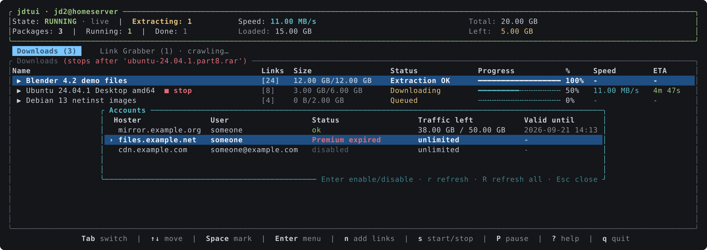
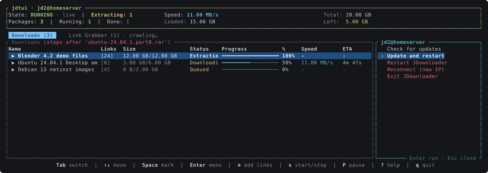

# jdtui

A terminal UI for [JDownloader 2](https://jdownloader.org/), talking to it through
the [My.JDownloader](https://my.jdownloader.org/) API.

Sign in once with your My.JDownloader account and `jdtui` shows the same tree as the
desktop GUI: packages with their links, split across a **Downloads** and a
**Link Grabber** tab. Nothing to enable on the JDownloader side, and it works
from anywhere the account does, with as many JDownloader instances as you have
connected to it.


## Install

```bash
cargo install --git https://github.com/rylos/jdtui
```

A single static binary; no runtime, no Python, no local API to switch on.

## First run

```bash
jdtui
```

You are asked for your My.JDownloader email and password. After the first
successful sign in they are saved to the config file (mode `0600`) and not asked
again unless they stop working. If the account has more than one JDownloader,
you pick one; the choice is remembered. Press `d` at any time to switch to
another one, or start with `jdtui --choose-device`.

## The interface

The header shows the state of the download controller (running, paused,
stopped), the total speed as JDownloader reports it, how much is loaded and
left, and anything that is waiting on you: captchas to solve, archives being
extracted. `s` starts and stops the downloads, `P` pauses and resumes them.

The footer lists the frequent keys; `?` opens the full reference.


### Acting on packages and links

`Space` marks rows, `a` marks them all, `Enter` opens the context menu on the
selection. Every entry acts on all marked rows at once, so a dozen links can be
forced, resumed, reset, disabled, moved or removed in a single action.
Destructive entries ask for confirmation first.


What the menu offers, depending on the tab and the selection:

- **Force download**, **Resume**, **Unskip**, **Reset**, **Enable / Disable**
- **Set priority…**, from highest to lowest

  

- **Rename…** a package or a link, **Set download folder…** for packages
- **Move to new package…**, **Split by hoster**
- **Copy urls**: shows the urls of the selection and puts them on the
  clipboard, through the terminal (OSC 52), so it also works over SSH
- **Check availability**, **Extract now**, **Delete finished links**
- **Stop after this**: the download list stops once this row is done; `t` does
  the same without opening the menu, and again on the same row clears it
- **Choose variant…** on a Link Grabber link that offers several, such as
  the qualities of a video
- **Remove**, **Move to download list** on the Link Grabber tab

Removing from the **Downloads** tab asks what should happen to the files already
on disk, the same three choices the desktop GUI offers: leave them, move them to
the recycle bin, or delete them. The two that touch data ask again before
running.


### Adding links

`n` opens the same form as the GUI's add dialog: urls, package name, destination
folder, extract and download passwords, priority and autostart. Pasting a list
of urls works; newlines become separators.


The **Link Grabber** tab shows what is waiting to be confirmed, with the
availability and hoster of every link, and says so while JDownloader is still
crawling what you added. `c` moves the whole list to the downloads, `C` clears
it, `x` aborts the crawling. `e` adds a password to the list JDownloader tries
on every archive.


### Accounts

`A` lists the premium accounts of the JDownloader with their traffic and
expiry, and lets you enable, disable or refresh them.



### The JDownloader itself

`D` opens a menu on the JDownloader you are connected to: check for updates,
restart, reconnect for a new IP, exit. Installing an update is offered only
when JDownloader reports one. Nothing that touches the host machine (shutdown,
standby) is there.



## Keys

| Key | Action |
| --- | --- |
| `Tab` | Switch between Downloads and Link Grabber |
| `↑` `↓` (or `k` `j`) | Move the cursor |
| `→` `←` | Expand / collapse a package |
| `/` | Filter the rows by name, hoster or status; `Esc` clears it |
| `Space` | Mark the row under the cursor |
| `a` | Mark every row, or clear the marks |
| `Esc` | Clear the selection |
| `Enter` | Open the context menu on the selection |
| `p` | Properties of the selected row |
| `n` | Add links to the Link Grabber |
| `t` | Stop downloads after the row under the cursor; again to clear |
| `y` | Show the urls of the selection and copy them to the clipboard |
| `e` | Add a password to the list tried on every archive |
| `c` | Move the whole Link Grabber to the download list |
| `C` | Clear the Link Grabber |
| `x` | Abort link crawling |
| `s` | Start / stop downloads |
| `P` | Pause / resume downloads |
| `A` | Premium accounts: enable, disable, refresh |
| `D` | The JDownloader itself: captchas, updates, restart, reconnect, exit |
| `d` | Switch to another JDownloader of the account |
| `?` | Show every key |
| `q` | Quit |

## Config

`~/.config/jdtui/config.toml` (print the exact path with `jdtui --config-path`):

```toml
email = "you@example.com"
password = "…"
# device id chosen last time; remove it to be asked again
device = "…"
# refresh period in milliseconds (default 1000)
refresh_ms = 1000
# listen to JDownloader's event channel (default true); --no-events for one run
events = true
```

## How it talks to JDownloader

The My.JDownloader protocol is implemented natively (`src/myjd.rs`): request ids,
HMAC-signed server calls, AES-CBC encrypted device calls, session and regain
tokens. The unit tests pin the key derivation, signature and cipher output
against the reference Python client, byte for byte.

Refreshes run on a background thread so the interface never waits on the
network. A refresh is four round trips through the relay (state, speed, the two
lists); what changes rarely (stop mark, crawling, extraction queue, captchas) is
fetched every fifth refresh and right after an action. Actions you trigger are
sent immediately and force an early refresh.

A second thread subscribes to JDownloader's event channel (`/events`) with a
session of its own and long-polls it. Anything that changes the lists, the
controller state, the captchas or the extraction queue wakes the refresh at
once, so a link added from the browser or another client shows up within a
second or two. While the channel is up and nothing is downloading, the
periodic refresh stretches to thirty seconds: the events cover the changes,
and the relay sees a fraction of the calls. The header says `live` while the
channel is up; if it drops, polling carries on at the configured period and
the channel is reopened every ten seconds.

## Screenshots

The images above are generated, not captured: `cargo run --example screenshots`
draws the real interface into a test buffer and writes `docs/*.svg`, converting
each to a PNG for this page. They cannot drift from the code, and the data in
them is invented.

## Changelog

See [CHANGELOG.md](CHANGELOG.md).

## Credits

Started as a rewrite of [jdsh](https://github.com/al00x/jdsh), whose interactive
mode I had been extending in Python before moving to a single binary.

## License

MIT
