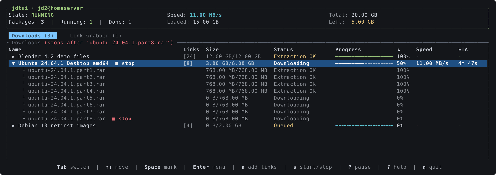
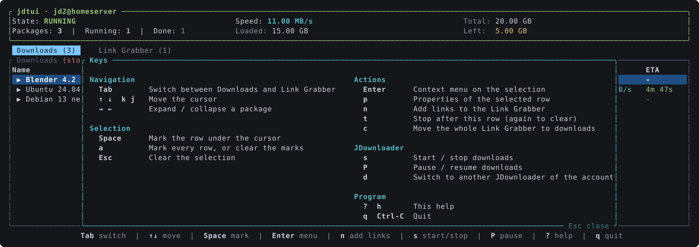
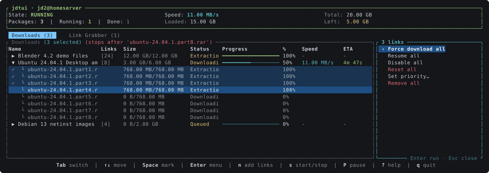
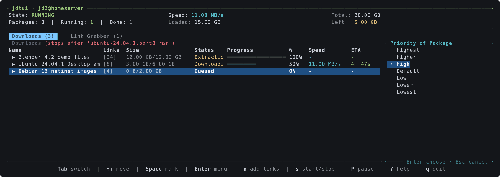
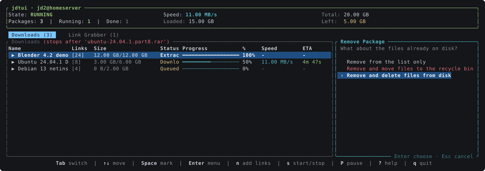
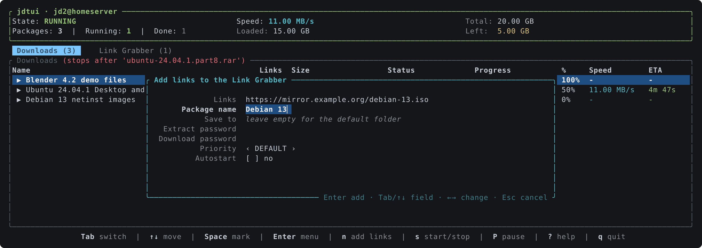
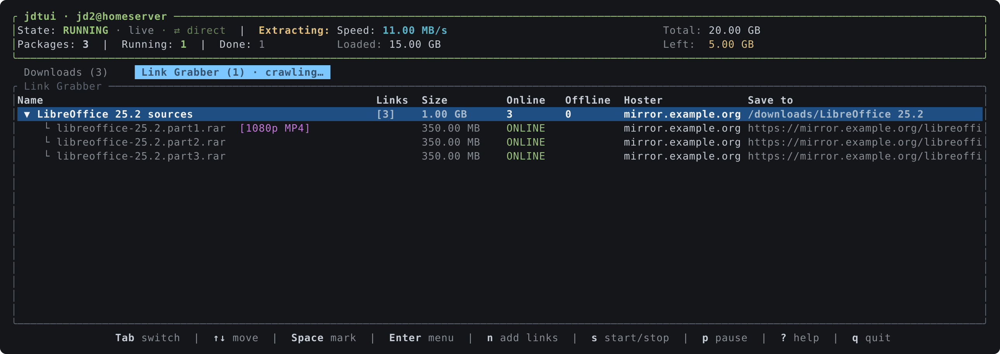

# jdtui

A terminal UI for [JDownloader 2](https://jdownloader.org/), talking to it through
the [My.JDownloader](https://my.jdownloader.org/) API.

Sign in once with your My.JDownloader account and `jdtui` shows the same tree as the
desktop GUI: packages with their links, split across a **Downloads** and a
**Link Grabber** tab. Nothing to enable on the JDownloader side, and it works
from anywhere the account does, with as many JDownloader instances as you have
connected to it.



## Install

```bash
cargo install --git https://github.com/rylos/jdtui
```

A single static binary; no runtime, no Python, no local API to switch on.

## First run

```bash
jdtui
```

You are asked for your My.JDownloader email and password. After the first
successful sign in they are saved to the config file (mode `0600`) and not asked
again unless they stop working. If the account has more than one JDownloader,
you pick one; the choice is remembered. Press `d` at any time to switch to
another one, or start with `jdtui --choose-device`.

## Keys

| Key | Action |
| --- | --- |
| `Tab` | Switch between Downloads and Link Grabber |
| `↑` `↓` (or `k` `j`) | Move the cursor |
| `→` `←` | Expand / collapse a package |
| `Space` | Mark the row under the cursor |
| `a` | Mark every row, or clear the marks |
| `Esc` | Clear the selection |
| `Enter` | Open the context menu on the selection |
| `p` | Properties of the selected row |
| `n` | Add links to the Link Grabber |
| `t` | Stop downloads after the row under the cursor; again to clear |
| `s` | Start / stop downloads |
| `P` | Pause / resume downloads |
| `d` | Switch to another JDownloader of the account |
| `c` | Move the whole Link Grabber to the download list |
| `?` | Show every key |
| `q` | Quit |

The footer shows the frequent keys; `?` opens the full list.



The context menu acts on every marked row at once, so a dozen links can be
forced, reset, disabled or removed in a single action. Destructive entries ask
for confirmation first.



The same menu changes the priority of the selection:



Removing from the **Downloads** tab asks what should happen to the files already
on disk, the same three choices the desktop GUI offers: leave them, move them to
the recycle bin, or delete them. The two that touch data ask again before
running.



`n` opens the same form as the GUI's add dialog: urls, package name, destination
folder, extract and download passwords, priority and autostart. Pasting a list
of urls works; newlines become separators.



The **Link Grabber** tab shows what is waiting to be confirmed, with the
availability and hoster of every link:



## Config

`~/.config/jdtui/config.toml` (print the exact path with `jdtui --config-path`):

```toml
email = "you@example.com"
password = "…"
# device id chosen last time; remove it to be asked again
device = "…"
# refresh period in milliseconds (default 1000)
refresh_ms = 1000
```

## How it talks to JDownloader

The My.JDownloader protocol is implemented natively (`src/myjd.rs`): request ids,
HMAC-signed server calls, AES-CBC encrypted device calls, session and regain
tokens. The unit tests pin the key derivation, signature and cipher output
against the reference Python client, byte for byte.

Refreshes run on a background thread so the interface never waits on the
network; actions you trigger are sent immediately and force an early refresh.

## Screenshots

The images above are generated, not captured: `cargo run --example screenshots`
draws the real interface into a test buffer and writes `docs/*.svg`, converting
each to a PNG for this page. They cannot drift from the code, and the data in
them is invented.

## Credits

Started as a rewrite of [jdsh](https://github.com/al00x/jdsh), whose interactive
mode I had been extending in Python before moving to a single binary.

## License

MIT
