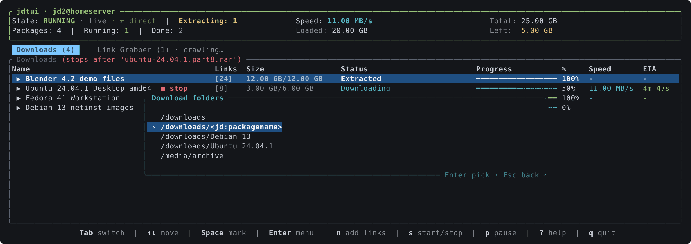
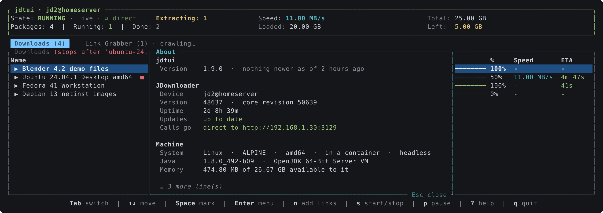

# jdtui

A terminal UI for [JDownloader 2](https://jdownloader.org/), talking to it through
the [My.JDownloader](https://my.jdownloader.org/) API.

Sign in once with your My.JDownloader account and `jdtui` shows the same tree as the
desktop GUI: packages with their links, split across a **Downloads** and a
**Link Grabber** tab. Nothing to enable on the JDownloader side, and it works
from anywhere the account does, with as many JDownloader instances as you have
connected to it.


## Install

```bash
cargo install --git https://github.com/rylos/jdtui
```

A single static binary; no runtime, no Python, no local API to switch on.

## First run

```bash
jdtui
```

You are asked for your My.JDownloader email and password. After the first
successful sign in they are saved to the config file (mode `0600`) and not asked
again unless they stop working. If the account has more than one JDownloader,
you pick one; the choice is remembered. Press `d` at any time to switch to
another one, or start with `jdtui --choose-device`.

## The interface

The header shows the state of the download controller (running, paused,
stopped), the total speed as JDownloader reports it, how much is loaded and
left, and anything that is waiting on you: captchas to solve, archives being
extracted. `s` starts and stops the downloads, `p` pauses and resumes them.

The **Status** column says what jdtui makes of a row rather than repeating
JDownloader's own sentence: an archive being unpacked reads `Extracting`, one
that came out whole `Extracted`, a damaged or password-protected one
`Extraction failed`. JDownloader writes those in whatever language it runs in,
and they rarely fit the column; jdtui works the state out from the extraction
queue and from what each link reports, which read the same everywhere. Its own
text is still shown for anything jdtui does not model, and in full under `i`.

While an archive is being unpacked the **ETA** column counts that down too:
JDownloader stops reporting a wait for the package then and puts one on each
of its links instead, so jdtui takes the longest of those. There is no
percentage to be had — the API reports no extraction progress at all, only
the time left.

The colour of that column follows the state rather than the words, for the
same reason: green for what is done with, cyan for what is moving, grey for
what is switched off. A finished link and a downloading one no longer look
alike whatever language they are written in.

The footer lists the frequent keys; `?` opens the full reference.


### Acting on packages and links

`Space` marks rows, `a` marks them all, `Enter` opens the context menu on the
selection. Every entry acts on all marked rows at once, so a dozen links can be
forced, resumed, reset, disabled, moved or removed in a single action.
Destructive entries ask for confirmation first.


What the menu offers, depending on the tab and the selection:

- **Force download**, **Resume**, **Unskip**, **Reset**, **Enable / Disable**
- **Set priority…**, from highest to lowest

  

- **Rename…** a package or a link, **Set download folder…** for packages
- **Move to new package…**, **Split by hoster**
- **Copy urls**: shows the urls of the selection and puts them on the
  clipboard, through the terminal (OSC 52), so it also works over SSH
- **Check availability**, **Extract now**, **Delete finished links**
- **Stop after this**: the download list stops once this row is done; `t` does
  the same without opening the menu, and again on the same row clears it
- **Choose variant…** on a Link Grabber link that offers several, such as
  the qualities of a video
- **Remove**, **Move to download list** on the Link Grabber tab

Removing from the **Downloads** tab asks what should happen to the files already
on disk, the same three choices the desktop GUI offers: leave them, move them to
the recycle bin, or delete them. The two that touch data ask again before
running.


### Adding links

`n` opens the same form as the GUI's add dialog: urls, package name, destination
folder, extract and download passwords, priority and autostart. Pasting a list
of urls works; newlines become separators. A line under the fields says where
the files will end up: jdtui reads JDownloader's default folder and whether the
packagizer's "create subfolder by package name" rule is on, so `/data` shows as
`/data/<package name>` when JDownloader will add the subfolder itself, and a
`<jd:packagename>` placeholder in the path is never doubled. On the folder
field, `Ctrl-F` lists
the folders JDownloader used lately (the same list as the GUI's combo,
`<jd:packagename>` placeholders included), the folders of the packages in the
lists and the mount points; pick one and edit it. The same picker serves the
download-folder and new-package forms.




The **Link Grabber** tab shows what is waiting to be confirmed, with the
availability and hoster of every link, and says so while JDownloader is still
crawling what you added. `c` moves the whole list to the downloads, `C` clears
it, `x` aborts the crawling. `e` adds a password to the list JDownloader tries
on every archive.


### Accounts

`A` lists the premium accounts of the JDownloader with their traffic and
expiry, and lets you enable, disable or refresh them.


### The JDownloader itself

`D` opens a menu on the JDownloader you are connected to: about it, check for
updates, restart, reconnect for a new IP, exit. Installing an update is offered only
when JDownloader reports one. Nothing that touches the host machine (shutdown,
standby) is there.


Its first entry, **About**, describes that JDownloader and the machine under
it: version and core revision, how long it has been up, whether an update is
waiting, whether calls reach it directly or through the relay, the operating
system and architecture, whether it runs in a container, its Java and its
heap, and the free space of every path it can write to. It answers the
questions worth asking when something looks wrong.



## Keys

| Key | Action |
| --- | --- |
| `Tab` | Switch between Downloads and Link Grabber |
| `↑` `↓` (or `k` `j`) | Move the cursor |
| `PgUp` `PgDn` | Move by a page |
| `Home` `End` (or `g` `G`) | First / last row |
| `→` `←` | Expand / collapse a package |
| `/` | Filter the rows by name, hoster or status; `Esc` clears it |
| `Space` | Mark the row under the cursor |
| `a` | Mark every row, or clear the marks |
| `Esc` | Clear the selection |
| `Enter` | Open the context menu on the selection |
| `i` (or `P`) | Properties of the selected row |
| `n` | Add links to the Link Grabber |
| `t` | Stop downloads after the row under the cursor; again to clear |
| `y` | Show the urls of the selection and copy them to the clipboard |
| `e` | Add a password to the list tried on every archive |
| `c` | Move the whole Link Grabber to the download list |
| `C` | Clear the Link Grabber |
| `x` | Abort link crawling |
| `s` | Start / stop downloads |
| `p` | Pause / resume downloads |
| `A` | Premium accounts: enable, disable, refresh |
| `D` | The JDownloader itself: captchas, updates, restart, reconnect, exit |
| `d` | Switch to another JDownloader of the account |
| `?` | Show every key |
| `q` | Quit |

## In a script

Given a command, jdtui answers it on stdout and exits instead of drawing:

```bash
jdtui status                    # what the download controller is doing
jdtui downloads                 # the download list
jdtui grabber                   # what is waiting to be confirmed
jdtui devices                   # the JDownloaders on the account
jdtui start | stop | pause | resume
jdtui add https://example.com/file --package Ubuntu --folder /data --autostart
cat urls.txt | jdtui add        # reads stdin when given no urls
```

`--json` prints the same thing as JSON, so the rest is `jq`:

```bash
jdtui status --json | jq -r '"\(.device): \(.state)"'
jdtui status --json | jq -e .running >/dev/null && echo "busy"
jdtui downloads --json | jq -r '.[] | select(.finished) | .name'
```

`--device` picks the JDownloader by name or id, whatever the config says.
Nothing is ever asked interactively, so the account has to be in the config
file already, which it is after the first run of the interface. A failure
prints to stderr and exits non-zero.

### Watching a folder

`jdtui watch <folder>` keeps an eye on a folder on **this** machine and hands
what lands in it to JDownloader: `.crawljob` files, in either shape Folder
Watch accepts, and `.dlc`, `.ccf` and `.rsdf` containers, which JDownloader
opens itself.

```bash
jdtui watch ~/jd-inbox                 # until Ctrl-C, looking every 5 seconds
jdtui watch ~/jd-inbox --interval 30
jdtui watch ~/jd-inbox --once          # sweep and exit, for cron
jdtui watch                            # the folder named in the config
```

Naming the folder in the config as `watch_folder` does two things: `jdtui
watch` takes it when you give it none, and **the interface watches it too
while it is open**, so a file dropped in it is picked up within a few seconds
without a second program running. `watch = false` stops that without making
you delete the path.

Each file is moved to `processed` beside it once JDownloader has taken it, or
to `failed` if it would not, so nothing is ever sent twice. A file is left
alone until it stops growing, and it is claimed by moving it before it is
read, which on Windows also skips whatever another program still holds open.
Files written with CRLF, with a byte order mark, or saved as UTF-16 are read
all the same, and the metadata files macOS leaves next to a copy are ignored.

JDownloader has a Folder Watch of its own, and when the folder is on the
machine JDownloader runs on, that one is the better tool: it needs no client
running at all. This is for a folder on your own machine, which JDownloader
cannot see. Note that a `downloadFolder` named inside a job is a path on the
JDownloader machine, not on this one.

## Config

`~/.config/jdtui/config.toml` (print the exact path with `jdtui --config-path`).

You never have to write it by hand: jdtui creates it after the first sign in
and keeps the credentials and the chosen device up to date, with mode `0600`.
Everything else is optional and has a working default.

```toml
email = "you@example.com"
password = "…"
# device id chosen last time; remove it to be asked again
device = "…"
# refresh period in milliseconds (default 1000)
refresh_ms = 1000
# listen to JDownloader's event channel (default true); --no-events for one run
events = true
# connect straight to JDownloader when it answers (default true); --no-direct
direct = true

# addresses JDownloader cannot report for itself, such as a container's host,
# keyed by device name so each one is tried for the machine it belongs to
[direct_addresses]
"jd2@docker" = ["192.168.1.30:3129"]
```

[**config.example.toml**](config.example.toml) is the same file with every key
explained: what it does, what it defaults to, and when you would change it.

## How it talks to JDownloader

The My.JDownloader protocol is implemented natively (`src/myjd.rs`): request ids,
HMAC-signed server calls, AES-CBC encrypted device calls, session and regain
tokens. The unit tests pin the key derivation, signature and cipher output
against the reference Python client, byte for byte.

Calls go to JDownloader directly when they can, as in the web interface:
jdtui asks JDownloader for the addresses it can be reached at (its "direct
connection" setting, LAN or WAN), pings them all at once and keeps the
best that answers: IPv6 before IPv4, then the quickest. IPv6 comes first not
for speed but because an IPv4 address is often behind carrier-grade NAT,
where the address JDownloader believes it has may not lead back to it. The payload is encrypted the same way either side of
the relay, so nothing changes on the wire but the host. The header says
`⇄ direct` or `☁ relay`; a direct route that stops answering falls back to
the relay on the spot and is looked for again every five minutes. A
JDownloader in a container only knows its own address, so `direct_addresses`
in the config adds the ones it cannot see, such as the Docker host; keyed by
device name when the account has several, since an address belongs to one
machine.

Refreshes run on a background thread so the interface never waits on the
network. A refresh is four round trips through the relay (state, speed, the two
lists); what changes rarely (stop mark, crawling, extraction queue, captchas) is
fetched every fifth refresh and right after an action. Actions you trigger are
sent immediately and force an early refresh.

A second thread subscribes to JDownloader's event channel (`/events`) with a
session of its own and long-polls it. Anything that changes the lists, the
controller state, the captchas or the extraction queue wakes the refresh at
once, so a link added from the browser or another client shows up within a
second or two. While the channel is up and nothing is downloading, the
periodic refresh stretches to thirty seconds: the events cover the changes,
and the relay sees a fraction of the calls. The header says `live` while the
channel is up; if it drops, polling carries on at the configured period and
the channel is reopened every ten seconds.

## Screenshots

The images above are generated, not captured: `cargo run --example screenshots`
draws the real interface into a test buffer and writes `docs/*.svg`, converting
each to a PNG for this page. They cannot drift from the code, and the data in
them is invented.

## Changelog

See [CHANGELOG.md](CHANGELOG.md).

## Credits

Started as a rewrite of [jdsh](https://github.com/al00x/jdsh), whose interactive
mode I had been extending in Python before moving to a single binary.

## 🍺 Buy me a beer

If jdtui saves you a trip to the browser now and then, a beer is welcome. ETH, USDT or any other token, on Ethereum or any EVM chain, to:

```
0xF4dd2D015b913E30429974c2b82e15df5b92fB19
```

## License

MIT
